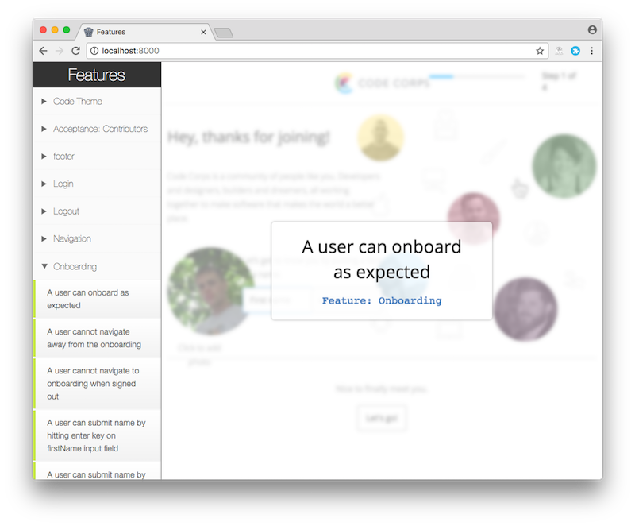

# telling-stories-site

Generate a visual documentation site for your Ember.js application by using [telling-stories](https://github.com/mvdwg/telling-stories).



## Installation

This addon assumes that you're already using [telling-stories](https://github.com/mvdwg/telling-stories) addon.

To install this addon just do:

```
$ ember install telling-stories-site
```

## Generate documentation site

To generate a visual documentation site for your app, just run

```
$ ember ts:build
```

This command generates a documentation site on dist/ folder. You can check it
out locally by running

```
$ cd dist/
$ python -m SimpleHTTPServer
```

## License

telling-stories-site is licensed under the MIT license.

See [LICENSE](./LICENSE) for the full license text.
